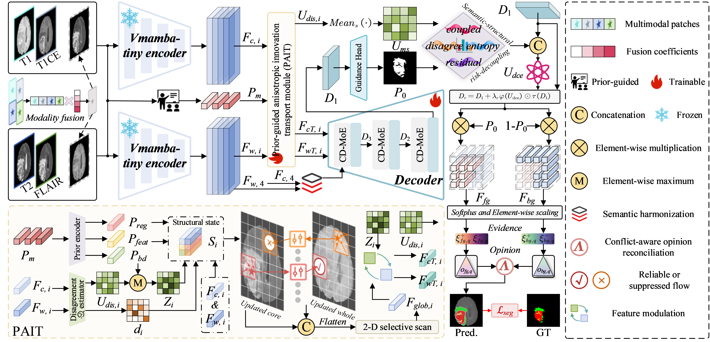
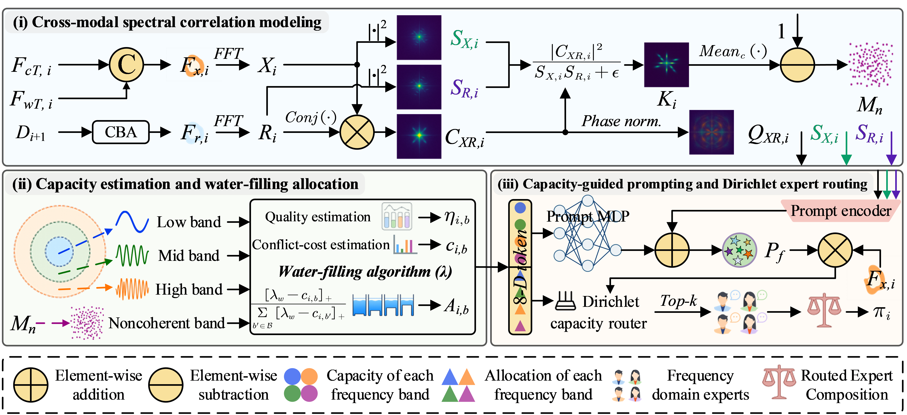

<div align="center">

# 🧠 DiTrust-Net

### Disagreement-to-Trust: Mixed-Evidence Learning for Multimodal Brain Tumor Segmentation

**Multimodal MRI · Brain Tumor Segmentation · Trustworthy Estimation**

[Architecture](#architecture) · [Results](#results) · [Getting Started](#requirements) · [Training & Testing](#training-testing) · [Pretrained Models](#pretrained-models)

</div>

This repository provides the implementation of **DiTrust-Net**, a disagreement-to-trust network for multimodal brain tumor segmentation on **BraTS 2020** and **BraTS 2021**.

DiTrust-Net treats cross-modal disagreement as mixed evidence: structurally supported differences guide representation learning, while unresolved conflicts inform prediction reliability. Given **FLAIR, T1, T1ce, and T2** MRI slices, the network predicts **whole tumor (WT), tumor core (TC), and enhancing tumor (ET)**.

<a id="architecture"></a>

## 🏗️ Architecture and Details

[](assets/architecture.png)

<p align="center"><a href="assets/architecture.png">🔍 View full-resolution architecture (6000 px)</a></p>

*Overall architecture of DiTrust-Net (Fig. 2 in the manuscript). PAIT is expanded below the main network; DCTE forms the trustworthy estimation branch after the decoder.*

The disagreement-to-trust pathway consists of three modules:

| Module | Role |
| --- | --- |
| **PAIT** — Prior-guided Anisotropic Innovation Transport | Screens cross-stream differences against structural priors and transports supported responses along learned anatomical directions. |
| **CD-MoE** — Capacity-aware Dirichlet Mixture-of-Experts | Uses spectral coherence to allocate expert capacity and sparsely route the transported features. |
| **DCTE** — Disagreement-calibrated Trustworthy Estimation | Combines unresolved disagreement with coarse ambiguity to discount unreliable evidence and reconcile WT–TC–ET predictions. |

<details>
<summary><b>🔎 View the CD-MoE module</b></summary>

[](assets/cd-moe.png)

[🔍 View full-resolution CD-MoE diagram (6000 px)](assets/cd-moe.png)

*CD-MoE combines cross-modal spectral correlation modeling, water-filling capacity allocation, and Dirichlet expert routing.*

</details>

<a id="results"></a>

## 📊 Results

Dice scores on the complete evaluation splits:

| Dataset | Evaluated slices | WT | TC | ET | Average |
| --- | ---: | ---: | ---: | ---: | ---: |
| BraTS2020 | 4,709 | 0.9145 | 0.8659 | 0.8702 | 0.8835 |
| BraTS2021 | 16,321 | 0.9326 | 0.9315 | 0.9018 | 0.9220 |

Evaluation uses 2D slices, sigmoid outputs with a threshold of 0.5, and global confusion-matrix Dice scores. Scores are computed with the repository's 2D evaluation protocol, rather than patient-wise 3D aggregation.

<a id="requirements"></a>

## 🛠️ Requirements

The reference environment uses Python 3.10, PyTorch 2.1.1, CUDA 12.1, and Triton 2.1.0. An NVIDIA GPU is required for the CUDA/Triton backbone operators.

```bash
git clone https://github.com/p1easure-z/DiTrust-Net.git
cd DiTrust-Net
pip install -r requirements.txt
```

Install a CUDA-compatible PyTorch build before building the CUDA extensions. See [requirements.txt](requirements.txt) for the pinned dependencies. The shell examples below use Bash.

## 📂 Data Preparation

Prepare BraTS 2020 or BraTS 2021 as NumPy slices using the following layout:

```text
/path/to/BraTS2020/        # Or /path/to/BraTS2021/
├── trainImage/            # Image arrays: [224, 224, 4]
├── trainGt/               # Label arrays: [224, 224]
├── testImage/
└── testGt/
```

Image channels must follow the order **FLAIR, T1, T1ce, T2**. Images and labels must have matching filenames. Labels use 0 for background and 1, 2, and 4 for tumor subregions; the loader constructs WT from {1, 2, 4}, TC from {1, 4}, and ET from {4}.

Set the corresponding dataset paths before training:

```bash
export BRATS2020_ROOT=/path/to/BraTS2020
export BRATS2021_ROOT=/path/to/BraTS2021
```

The original preprocessing script is [data/dataset_preprocess.py](data/dataset_preprocess.py). It expects `BRATS_HGG_ROOT` and `BRATS_LGG_ROOT` and writes `trainImage/` and `trainGt/` relative to the working directory. It assumes an HGG/LGG source layout; check your dataset layout before using it. Prepare the training and evaluation split separately.

<a id="training-testing"></a>

## 🚀 Training & Testing

### Training

First place the VMamba-Tiny pretrained weights at the path specified under [Pretrained Models](#pretrained-models). Then run:

```bash
# BraTS 2020
python train.py --dataset_name BraTS2020 --epochs 200 --batch_size 8

# BraTS 2021
python train.py --dataset_name BraTS2021 --epochs 200 --batch_size 8
```

Training freezes the backbone by default. Ensure the pretrained backbone file is present before using this setting. To train the backbone as well, pass `--freeze_backbone false`. Logs, loss curves, and epoch checkpoints are saved under `results/`; use `--save_dir` to change the output directory.

### Testing

Place the corresponding DiTrust-Net checkpoint in `results/`, then run:

```bash
# BraTS 2020
python validate.py --dataset-name BraTS2020 --data-root /path/to/BraTS2020 --ckpt results/DiTrust-Net-2020.pth

# BraTS 2021
python validate.py --dataset-name BraTS2021 --data-root /path/to/BraTS2021 --ckpt results/DiTrust-Net-2021.pth
```

Use `--ckpt` to select a checkpoint stored elsewhere.

## 📏 Evaluation

[validate.py](validate.py) uses the project's [metric implementation](kits/metrics.py) to report Dice, IoU, sensitivity, and slice-averaged Hausdorff-95 for WT, TC, and ET. JSON and CSV reports are written to:

```text
results/validation/<dataset>/<checkpoint-name>/
├── validation_metrics.json
└── validation_metrics.csv
```

Use `--output-dir` to change the report location. For a short execution check, add `--max-samples 16`; omit it for complete-split evaluation.

<a id="pretrained-models"></a>

## 📥 Pretrained Models

### DiTrust-Net checkpoints

| Dataset | Checkpoint | Baidu Netdisk | Extraction code |
| --- | --- | --- | --- |
| BraTS2020 | `DiTrust-Net-2020.pth` | TODO: add share link | TODO |
| BraTS2021 | `DiTrust-Net-2021.pth` | TODO: add share link | TODO |

The two checkpoints will be shared through **Baidu Netdisk**. Share links and extraction codes will be added here. Each file is approximately 410 MiB. See [checkpoint details](docs/checkpoints.md) for SHA-256 checksums and placement instructions.

### Backbone initialization

Training looks for the VMamba-Tiny checkpoint at:

```text
backbone/vmamba/ckpt/vssm1_tiny_0230s_ckpt_epoch_264.pth
```

Download the official [VMamba-Tiny pretrained weights](https://github.com/MzeroMiko/VMamba/releases/download/%23v2cls/vssm1_tiny_0230s_ckpt_epoch_264.pth) and place the file at the path above. The download is listed in the upstream [VMamba repository](https://github.com/MzeroMiko/VMamba). Evaluation loads the complete DiTrust-Net checkpoint and does not require a separate backbone checkpoint.

## 🙏 Acknowledgements

The backbone implementation is based on [VMamba](https://github.com/MzeroMiko/VMamba) and includes operator code from [Mamba](https://github.com/state-spaces/mamba). See [THIRD_PARTY_NOTICES.md](THIRD_PARTY_NOTICES.md) for attribution and license notices.

## 📄 License

DiTrust-Net contributions are licensed under the Apache License 2.0. See [LICENSE](LICENSE). Third-party components retain their original terms.

<details>
<summary><b>📁 Repository Structure</b></summary>

```text
DiTrust-Net/
├── assets/                # Architecture and module figures
├── backbone/vmamba/       # VMamba backbone and operators
├── data/                  # Data loading and preprocessing
├── docs/checkpoints.md    # Checkpoint checksums and usage
├── kits/                  # Losses, metrics, and utilities
├── networks/Net.py        # DiTrust-Net model
├── train.py               # Training entry point
├── trainer.py             # Training and validation loop
└── validate.py            # Standalone evaluation
```

</details>

## 💬 Contact

For questions or bug reports, please open an [issue](https://github.com/p1easure-z/DiTrust-Net/issues).
